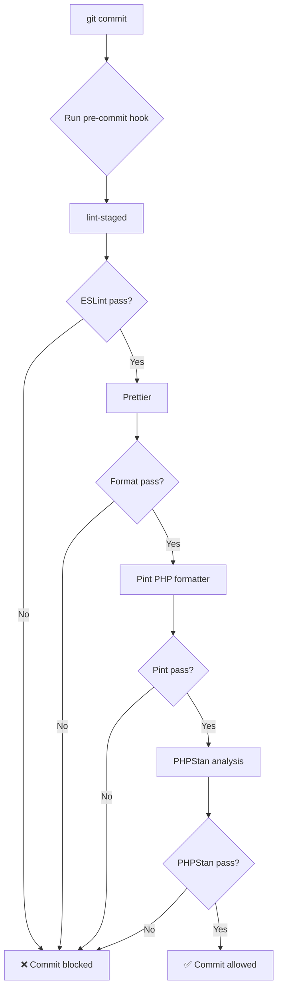

# Git Hooks with Husky

This project uses Husky to run automated checks before commits.

## Pre-Commit Hook

The pre-commit hook runs the following checks:

### Frontend Checks (lint-staged)

- **ESLint**: Lints and fixes JavaScript/TypeScript files
- **Prettier**: Formats JavaScript, TypeScript, JSON, CSS, and Markdown files

### Backend Checks

- **Pint**: Formats PHP files according to PSR-12 standard
- **PHPStan**: Runs static analysis on changed PHP files (level 8)

## Bypassing Hooks (NOT RECOMMENDED)

In rare cases where you need to bypass hooks (e.g., WIP commits):

```bash
git commit --no-verify -m "WIP: work in progress"
```

⚠️ **Warning**: Only use `--no-verify` for WIP commits on feature branches. Never bypass hooks on main branch.

## Installing Hooks

Hooks are automatically installed when you run:

```bash
npm install
```

This triggers the `prepare` script which runs `husky`.

## Hook Execution Flow



## Troubleshooting

### Hook not running

```bash
# Reinstall hooks
rm -rf .husky/_
npm run prepare
```

### PHPStan errors on vendor files

PHPStan only analyzes files you changed (staged). Vendor files are ignored.

### Slow hook execution

The hook only checks changed files, not the entire codebase. If still slow:

- Consider reducing PHPStan level from 8 to 7
- Add `.phpstan-baseline.neon` for gradual adoption

## Configuration Files

- `.husky/pre-commit` - Pre-commit hook script
- `.lintstagedrc.json` - lint-staged configuration (frontend)
- `pint.json` - Pint configuration (PHP formatter)
- `phpstan.neon` - PHPStan configuration (static analysis)

## Benefits

✅ **Code Quality**: Catches errors before they reach CI/CD
✅ **Consistency**: Enforces formatting standards automatically
✅ **Fast Feedback**: Developers fix issues immediately, not hours later
✅ **Clean History**: Every commit passes quality checks
